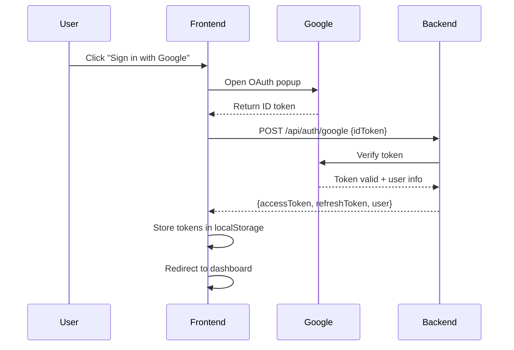

# PAF Frontend - Smart Campus Operations Hub

**Next.js React Application for University Management System**

---

## 📋 Overview

This is the frontend web application for the Smart Campus Operations Hub, built with Next.js 16, React 19, and TypeScript. It provides an intuitive interface for managing facility bookings, incident tickets, and user profiles with Google OAuth authentication.

### Key Features

- ✅ **Modern React 19** with Next.js 16 App Router
- ✅ **TypeScript** for type safety
- ✅ **Tailwind CSS** for responsive styling
- ✅ **Google OAuth 2.0** authentication
- ✅ **JWT Token Management** with automatic refresh
- ✅ **Protected Routes** with role-based access
- ✅ **Real-time Notifications** system
- ✅ **Responsive Design** (mobile, tablet, desktop)
- ✅ **Form Validation** with error handling
- ✅ **File Upload** support (multipart forms)

---

## 🛠 Tech Stack

| Component | Technology | Version |
|-----------|-----------|---------|
| **Framework** | Next.js | 16.2.4 |
| **UI Library** | React | 19.2.4 |
| **Language** | TypeScript | 5.x |
| **Styling** | Tailwind CSS | 3.4.19 |
| **HTTP Client** | Axios | 1.15.0 |
| **Authentication** | @react-oauth/google | 0.12.1 |
| **JWT Decoding** | jwt-decode | 4.0.0 |
| **Testing** | Jest + React Testing Library | 30.x |
| **Linting** | ESLint | 9.x |

---

## 📁 Project Structure

```
paf_frontend/
├── src/
│   ├── app/                         # Next.js App Router pages
│   │   ├── layout.tsx               # Root layout with providers
│   │   ├── page.tsx                 # Home/Dashboard page
│   │   ├── login/
│   │   │   └── page.tsx             # Login page
│   │   ├── resources/
│   │   │   ├── page.tsx             # Resource listing
│   │   │   └── [id]/page.tsx        # Resource details
│   │   ├── bookings/
│   │   │   ├── page.tsx             # My bookings
│   │   │   ├── create/page.tsx      # Create booking
│   │   │   └── [id]/edit/page.tsx   # Edit booking
│   │   ├── incidents/
│   │   │   ├── page.tsx             # Incident list
│   │   │   ├── create/page.tsx      # Create ticket
│   │   │   └── [id]/page.tsx        # Ticket details
│   │   ├── admin/
│   │   │   ├── page.tsx             # Admin dashboard
│   │   │   ├── bookings/page.tsx    # Manage bookings
│   │   │   └── tickets/page.tsx     # Manage tickets
│   │   └── profile/
│   │       └── page.tsx             # User profile
│   ├── components/                  # Reusable UI components
│   │   ├── AppNavbar.tsx            # Navigation bar
│   │   ├── ProtectedRoute.tsx       # Auth guard component
│   │   ├── NotificationBell.tsx     # Notification dropdown
│   │   ├── ResourceTable.tsx        # Resource listing table
│   │   ├── BookingCard.tsx          # Booking display card
│   │   ├── IncidentForm.tsx         # Ticket creation form
│   │   ├── CommentThread.tsx        # Comment section
│   │   ├── Toast.tsx                # Toast notifications
│   │   └── ...
│   ├── context/                     # React Context providers
│   │   └── AuthContext.tsx          # Authentication state
│   ├── services/                    # API service layer
│   │   ├── api.ts                   # Axios instance with interceptors
│   │   ├── authService.ts           # Auth API calls
│   │   ├── bookingService.ts        # Booking API calls
│   │   ├── resourceService.ts       # Resource API calls
│   │   ├── incidentService.ts       # Incident API calls
│   │   └── notificationService.ts   # Notification API calls
│   └── types/                       # TypeScript type definitions
│       ├── auth.types.ts
│       ├── booking.types.ts
│       ├── resource.types.ts
│       ├── incident.types.ts
│       └── notification.types.ts
├── public/                          # Static assets
│   ├── images/
│   └── icons/
├── .env.local                       # Environment variables (not committed)
├── .env.example                     # Environment template
├── next.config.js                   # Next.js configuration
├── tailwind.config.js               # Tailwind CSS configuration
├── tsconfig.json                    # TypeScript configuration
├── package.json                     # Dependencies
├── Dockerfile                       # Docker container config
└── README.md                        # This file
```

---

## 🚀 Getting Started

### Prerequisites

- **Node.js 18+** (with npm)
- **Git**
- **Backend API** running on `http://localhost:8082`

### Installation

1. **Clone the repository**
   ```bash
   git clone <repository-url>
   cd paf_frontend
   ```

2. **Install dependencies**
   ```bash
   npm install
   ```

3. **Set up environment variables**
   
   Create `.env.local` file:
   ```env
   # API Configuration
   NEXT_PUBLIC_API_BASE_URL=http://localhost:8082
   
   # Google OAuth Configuration
   # Get from https://console.cloud.google.com/apis/credentials
   NEXT_PUBLIC_GOOGLE_CLIENT_ID=your_google_oauth_client_id_here
   ```

4. **Run development server**
   ```bash
   npm run dev
   ```

   The app will start on `http://localhost:3000`

5. **Build for production**
   ```bash
   npm run build
   npm start
   ```

---

## 🔑 Google OAuth Setup

### Obtaining Google Client ID

1. Go to [Google Cloud Console](https://console.cloud.google.com/)
2. Create a new project or select existing
3. Enable **Google+ API**
4. Navigate to **Credentials** → **Create OAuth 2.0 Client ID**
5. Select **Web Application**
6. Add authorized JavaScript origins:
   - `http://localhost:3000`
   - Your production domain (e.g., `https://yourdomain.com`)
7. Copy the **Client ID** and add to `.env.local`

---

## 📱 Pages & Features

### Public Pages

| Route | Component | Description |
|-------|-----------|-------------|
| `/` | Dashboard | Landing page with overview |
| `/login` | Login | Google OAuth sign-in |
| `/resources` | Resources | Browse available resources |
| `/resources/[id]` | Resource Details | View resource information |

### Protected Pages (Requires Authentication)

| Route | Component | Description | Roles |
|-------|-----------|-------------|-------|
| `/bookings` | My Bookings | View user's bookings | USER |
| `/bookings/create` | Create Booking | Request new booking | USER |
| `/bookings/[id]/edit` | Edit Booking | Modify booking | USER (own) |
| `/incidents` | My Tickets | View user's tickets | USER |
| `/incidents/create` | Create Ticket | Report incident | USER |
| `/incidents/[id]` | Ticket Details | View ticket with comments | USER |
| `/profile` | User Profile | View/edit profile | USER |

### Admin Pages (Requires ADMIN Role)

| Route | Component | Description |
|-------|-----------|-------------|
| `/admin` | Admin Dashboard | Overview statistics |
| `/admin/bookings` | Manage Bookings | Approve/reject bookings |
| `/admin/tickets` | Manage Tickets | Assign technicians, update status |
| `/admin/users` | User Management | View/edit users |

---

## 🔐 Authentication Flow

### Login Process



### Token Management

- **Access Token**: Stored in `localStorage`, expires in 15 minutes
- **Refresh Token**: Stored in `localStorage`, expires in 7 days
- **Auto-Refresh**: Axios interceptor automatically refreshes expired tokens
- **Logout**: Clears tokens and redirects to login

### Protected Routes

```tsx
// Example: Protected page component
'use client';

import { useAuth } from '@/context/AuthContext';
import { useRouter } from 'next/navigation';
import { useEffect } from 'react';

export default function MyBookingsPage() {
  const { user, loading } = useAuth();
  const router = useRouter();

  useEffect(() => {
    if (!loading && !user) {
      router.push('/login');
    }
  }, [user, loading, router]);

  if (loading) return <div>Loading...</div>;
  if (!user) return null;

  return <div>My Bookings Content</div>;
}
```

---

## 🎨 UI Components

### Core Components

**AppNavbar**
- Responsive navigation bar
- User profile dropdown
- Notification bell with badge
- Role-based menu items

**NotificationBell**
- Real-time notification count
- Dropdown with recent notifications
- Mark as read functionality
- Click to navigate to related item

**ResourceTable**
- Sortable columns
- Filter by type, capacity, location
- Pagination support
- Click to view details

**BookingCard**
- Display booking information
- Status badges (PENDING, APPROVED, REJECTED, CANCELLED)
- Action buttons (Edit, Cancel)
- Responsive layout

**IncidentForm**
- Multi-step form for ticket creation
- File upload (up to 3 images)
- Category and priority selection
- Form validation

**CommentThread**
- Display comments with timestamps
- Edit/delete own comments
- Real-time updates
- Author information

**Toast**
- Success/error/info notifications
- Auto-dismiss after 5 seconds
- Stacked notifications
- Accessible (ARIA labels)

---

## 🌐 API Integration

### Axios Configuration

```typescript
// src/services/api.ts
import axios from 'axios';

const api = axios.create({
  baseURL: process.env.NEXT_PUBLIC_API_BASE_URL,
  headers: {
    'Content-Type': 'application/json',
  },
});

// Request interceptor: Add JWT token
api.interceptors.request.use((config) => {
  const token = localStorage.getItem('accessToken');
  if (token) {
    config.headers.Authorization = `Bearer ${token}`;
  }
  return config;
});

// Response interceptor: Handle token refresh
api.interceptors.response.use(
  (response) => response,
  async (error) => {
    if (error.response?.status === 401) {
      // Attempt token refresh
      const refreshToken = localStorage.getItem('refreshToken');
      if (refreshToken) {
        try {
          const { data } = await axios.post('/api/auth/refresh', { refreshToken });
          localStorage.setItem('accessToken', data.accessToken);
          // Retry original request
          error.config.headers.Authorization = `Bearer ${data.accessToken}`;
          return axios(error.config);
        } catch {
          // Refresh failed, logout
          localStorage.clear();
          window.location.href = '/login';
        }
      }
    }
    return Promise.reject(error);
  }
);

export default api;
```

### Service Layer Example

```typescript
// src/services/bookingService.ts
import api from './api';
import { Booking, BookingRequest } from '@/types/booking.types';

export const bookingService = {
  // Get all bookings
  getBookings: async (): Promise<Booking[]> => {
    const { data } = await api.get('/api/bookings');
    return data;
  },

  // Create booking
  createBooking: async (request: BookingRequest): Promise<Booking> => {
    const { data } = await api.post('/api/bookings', request);
    return data;
  },

  // Approve booking (admin only)
  approveBooking: async (id: number, note: string): Promise<Booking> => {
    const { data } = await api.patch(`/api/bookings/${id}/approve`, { approvalNote: note });
    return data;
  },

  // Cancel booking
  cancelBooking: async (id: number): Promise<void> => {
    await api.patch(`/api/bookings/${id}/cancel`);
  },
};
```

---

## 🧪 Testing

### Run Tests

```bash
# Run all tests
npm test

# Run with coverage
npm test -- --coverage

# Run in watch mode
npm test -- --watch
```

### Test Structure

```
src/
├── __tests__/
│   ├── components/
│   │   ├── AppNavbar.test.tsx
│   │   ├── BookingCard.test.tsx
│   │   └── ...
│   ├── services/
│   │   ├── authService.test.ts
│   │   ├── bookingService.test.ts
│   │   └── ...
│   └── pages/
│       ├── login.test.tsx
│       └── ...
```

### Example Test

```typescript
import { render, screen, fireEvent } from '@testing-library/react';
import BookingCard from '@/components/BookingCard';

describe('BookingCard', () => {
  const mockBooking = {
    id: 1,
    resourceName: 'Lab A1',
    startTime: '2026-04-30T10:00:00',
    endTime: '2026-04-30T12:00:00',
    status: 'PENDING',
  };

  it('renders booking information', () => {
    render(<BookingCard booking={mockBooking} />);
    expect(screen.getByText('Lab A1')).toBeInTheDocument();
    expect(screen.getByText('PENDING')).toBeInTheDocument();
  });

  it('calls onCancel when cancel button clicked', () => {
    const onCancel = jest.fn();
    render(<BookingCard booking={mockBooking} onCancel={onCancel} />);
    
    fireEvent.click(screen.getByText('Cancel'));
    expect(onCancel).toHaveBeenCalledWith(1);
  });
});
```

---

## 🎨 Styling with Tailwind CSS

### Configuration

```javascript
// tailwind.config.js
module.exports = {
  content: [
    './src/app/**/*.{js,ts,jsx,tsx}',
    './src/components/**/*.{js,ts,jsx,tsx}',
  ],
  theme: {
    extend: {
      colors: {
        primary: '#3b82f6',
        secondary: '#8b5cf6',
        success: '#10b981',
        warning: '#f59e0b',
        danger: '#ef4444',
      },
    },
  },
  plugins: [],
};
```

### Example Component Styling

```tsx
export default function BookingCard({ booking }) {
  const statusColors = {
    PENDING: 'bg-yellow-100 text-yellow-800',
    APPROVED: 'bg-green-100 text-green-800',
    REJECTED: 'bg-red-100 text-red-800',
    CANCELLED: 'bg-gray-100 text-gray-800',
  };

  return (
    <div className="bg-white rounded-lg shadow-md p-6 hover:shadow-lg transition-shadow">
      <h3 className="text-xl font-semibold text-gray-800">{booking.resourceName}</h3>
      <span className={`inline-block px-3 py-1 rounded-full text-sm font-medium ${statusColors[booking.status]}`}>
        {booking.status}
      </span>
    </div>
  );
}
```

---

## 🐳 Docker Deployment

### Build Docker Image

```bash
docker build -t paf-frontend:latest .
```

### Run Container

```bash
docker run -d \
  -p 3000:3000 \
  -e NEXT_PUBLIC_API_BASE_URL=http://backend:8082 \
  -e NEXT_PUBLIC_GOOGLE_CLIENT_ID=your_client_id \
  --name paf-frontend \
  paf-frontend:latest
```

### Docker Compose

From project root:
```bash
docker-compose up frontend
```

---

## 📊 Performance Optimization

### Next.js Features Used

- **App Router**: Modern routing with layouts
- **Server Components**: Reduced client-side JavaScript
- **Image Optimization**: Next.js `<Image>` component
- **Code Splitting**: Automatic route-based splitting
- **Lazy Loading**: Dynamic imports for heavy components

### Best Practices

```tsx
// Lazy load heavy components
import dynamic from 'next/dynamic';

const HeavyChart = dynamic(() => import('@/components/HeavyChart'), {
  loading: () => <div>Loading chart...</div>,
  ssr: false,
});

// Optimize images
import Image from 'next/image';

<Image
  src="/images/resource.jpg"
  alt="Resource"
  width={400}
  height={300}
  priority={false}
/>
```

---

## 🔧 Configuration

### Environment Variables

| Variable | Description | Example |
|----------|-------------|---------|
| `NEXT_PUBLIC_API_BASE_URL` | Backend API URL | `http://localhost:8082` |
| `NEXT_PUBLIC_GOOGLE_CLIENT_ID` | Google OAuth Client ID | `123456789-abc.apps.googleusercontent.com` |

### Next.js Configuration

```javascript
// next.config.js
module.exports = {
  reactStrictMode: true,
  images: {
    domains: ['lh3.googleusercontent.com'], // Google profile images
  },
  async rewrites() {
    return [
      {
        source: '/api/:path*',
        destination: `${process.env.NEXT_PUBLIC_API_BASE_URL}/api/:path*`,
      },
    ];
  },
};
```

---

## 🚨 Error Handling

### Global Error Boundary

```tsx
'use client';

export default function Error({ error, reset }) {
  return (
    <div className="min-h-screen flex items-center justify-center">
      <div className="text-center">
        <h2 className="text-2xl font-bold text-red-600">Something went wrong!</h2>
        <p className="text-gray-600 mt-2">{error.message}</p>
        <button
          onClick={reset}
          className="mt-4 px-4 py-2 bg-blue-500 text-white rounded hover:bg-blue-600"
        >
          Try again
        </button>
      </div>
    </div>
  );
}
```

### API Error Handling

```typescript
try {
  const booking = await bookingService.createBooking(request);
  toast.success('Booking created successfully!');
} catch (error) {
  if (error.response?.status === 409) {
    toast.error('Booking conflict: Resource already booked for this time');
  } else if (error.response?.status === 403) {
    toast.error('You do not have permission to perform this action');
  } else {
    toast.error('Failed to create booking. Please try again.');
  }
}
```

---

## 📚 Additional Documentation

- [API Reference](../docs/API_REFERENCE.md) - Backend API documentation
- [Frontend Architecture](../docs/FRONTEND_ARCHITECTURE.md) - Detailed architecture
- [Environment Setup](../docs/ENVIRONMENT_SETUP.md) - Configuration guide
- [Quick Start](../docs/QUICK_START.md) - Getting started guide

---

## 🤝 Contributing

### Code Style

- Use TypeScript for all new files
- Follow React best practices (hooks, functional components)
- Use Tailwind CSS for styling (avoid inline styles)
- Write tests for all components
- Use meaningful variable and function names

### Commit Messages

```bash
git commit -m "feat(bookings): add booking creation form by @YourName"
git commit -m "fix(auth): resolve token refresh issue by @YourName"
git commit -m "style(navbar): improve mobile responsiveness by @YourName"
```

---

## 📝 License

This project is for educational purposes as part of the IT3030 PAF Assignment 2026 at SLIIT.

---

## 📞 Support

For issues or questions:
- Check the [Quick Start Guide](../docs/QUICK_START.md)
- Review [API Reference](../docs/API_REFERENCE.md)
- Open an issue on GitHub

---

**Last Updated**: April 30, 2026  
**Version**: 1.0.0  
**Status**: ✅ Production Ready
